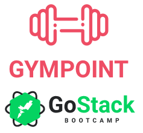

<h1 align="center">
  

Fullstack GymPoint

</h1>

<h4 align="center">
Gym management platform with Node.js, React and React Native
</h4>

<p align="center">
  

  

  

  <a href="https://api.codacy.com/project/badge/Grade/6b03ed543d484ebd95335fd26235b077" target="_blank">
    
  </a>

  
</p>

## :eyes: Visuals

<p align="center">
  
  <br/>
  
</p>

## :rocket: Technologies

This project was developed at the [RocketSeat GoStack Bootcamp](https://rocketseat.com.br/bootcamp) with the following technologies:

- [Node.js](https://nodejs.org/en/)
- [ReactJS](https://reactjs.org/)
- [React Native](https://facebook.github.io/react-native/)
- [Redux](https://redux.js.org/)
- [React Navigation](https://reactnavigation.org/)
- [Axios](https://github.com/axios/axios)
- [Immer](https://github.com/immerjs/immer)
- [Redux-Saga](https://redux-saga.js.org/)
- [Express](https://expressjs.com/)
- [nodemon](https://nodemon.io/)
- [Sucrase](https://github.com/alangpierce/sucrase)
- [Docker](https://www.docker.com/docker-community)
- [Sequelize](http://docs.sequelizejs.com/)
- [PostgreSQL](https://www.postgresql.org/)
- [node-postgres](https://www.npmjs.com/package/pg)
- [Redis](https://redis.io/)
- [JWT](https://jwt.io/)
- [Bcrypt](https://www.npmjs.com/package/bcrypt)
- [Yup](https://www.npmjs.com/package/yup)
- [Bee Queue](https://www.npmjs.com/package/bcrypt)
- [Nodemailer](https://nodemailer.com/about/)
- [History](https://www.npmjs.com/package/history)
- [date-fns](https://date-fns.org/)
- [DotEnv](https://www.npmjs.com/package/dotenv)
- [styled-components](https://www.styled-components.com/)
- [Reactotron](https://infinite.red/reactotron)
- [VS Code](https://code.visualstudio.com/) with [EditorConfig](https://marketplace.visualstudio.com/items?itemName=EditorConfig.EditorConfig) and [ESLint](https://marketplace.visualstudio.com/items?itemName=dbaeumer.vscode-eslint)

## :information_source: How To Use

To clone and run this application, you'll need [Git](https://git-scm.com), [Node.js v10.16](https://nodejs.org/) or higher, [Yarn v1.13](https://yarnpkg.com/) or higher installed on your computer. From your command line:

```bash
# Clone this repository
$ git clone https://github.com/matheuskuster/gostack-gympoint

# Go into the repository
$ cd gostack-gympoint
```

##### Enviroment Variables

Rename `.env.example` file from <a href="https://github.com/matheuskuster/gostack-gympoint/blob/master/backend/.env.example">backend</a> to `.env` and replace the enviroment variables from your choice.

```bash
APP_PORT=3333 # Backend port

APP_SECRET=gympoint # Secret key for authentication

DB_HOST=localhost # Database host
DB_USER=postgres # Database user
DB_PASS=docker # Database password
DB_NAME=gympoint # Database name

MAIL_HOST=smtp.mailtrap.io # SMTP host for email service
MAIL_USER= # Email service user
MAIL_PASS= # Email service password

REDIS_HOST=127.0.0.1 # Redis host
REDIS_PORT=6379 # Redis port
```

<details>
<summary>Server - Node.js</summary>
From your command line:

```bash
# Go into the backend folder
cd backend

# Install dependencies
yarn install

# Create, migrate and seed database
yarn sequelize db:create
yarn sequelize db:migrate
yarn sequelize db:seed:all

# Run main server
yarn dev

# Run queue server
yarn queue
```

</details>

<details>
<summary>Web - ReactJS</summary>
From your command line:

```bash
# Go into the web folder
cd web

# Install dependencies
yarn install

# Run it
yarn start
```

</details>

<details>
<summary>Mobile - React Native</summary>
<b>Notice:</b> The mobile version was tested just in Android environment.
I can't guarantee a properly behavior at iOS devices.
<br/>
<br/>
<p>From your command line:</p>

```bash
# Go into the mobile folder
cd mobile

# Install dependencies
yarn install

# Start Metro Server
react-native start

# Run Android version
react-native run-android

# Run iOS version (XCode necessary)
react-native run-ios
```

</details>

## :memo: License

This project is under the MIT license. See the [LICENSE](https://github.com/matheuskuster/gostack-gympoint/blob/master/LICENSE) for more information.

---

Made with ♥ by Matheus Kuster :wave: [Get in touch!](https://www.linkedin.com/in/matheus-kuster/)
